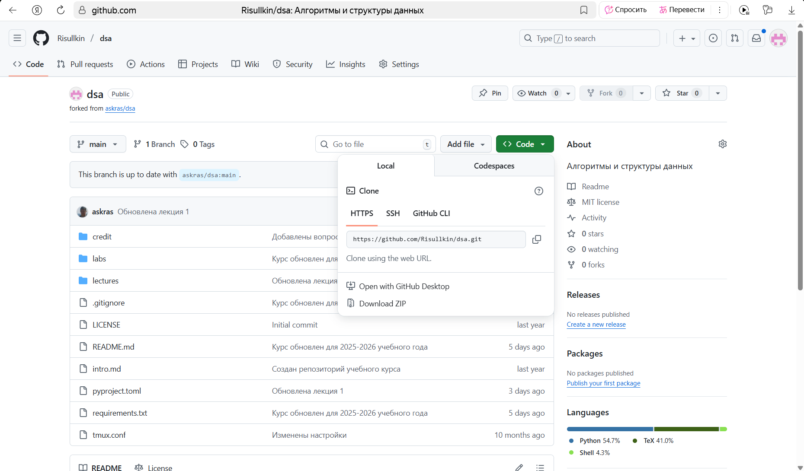
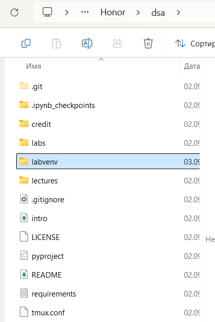
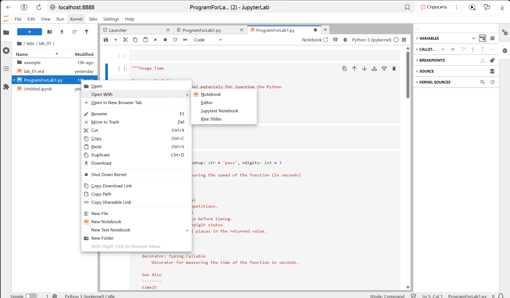

# Установка и настрока Jupiter Lab на Windows (проверено на Windows 11 Home) для дисциплины Алгоритмы и структуры данных
## 1. Скачиваем Anaconda с официального сайта: https://www.anaconda.com/download.
## 2. Заходим в репозиторий dsa на гитхаб https://github.com/askras/dsa и делаем форк его к себе в аккаунт:

## 3. В своем аккаунте выбираем репозиторий dsa и копируем ключ SSH:

## 4. В командной строке переходим в папку, куда хотим склонировать репозиторий и прописываем команду **git clone “вставляем наш ключ”**.
## 5. Проверяем установлен ли питон командой **python –version**, должны увидеть следующий результат:

## (главное чтобы была написана версия питона, цифры могут отличаться, но версия должна быть не ниже 3.13, если цифр нет или текст отличается, то нужно установить питон).
## 6. Заходим в WindowsPowershell и переходим в папку с нашим репозиторием на ПК командой **cd “путь к папке dsa”**.
## 7. Прописываем команду **python -m venv labvenv**, должна появиться папка labvenv в папке dsa:

## 8. Переходим в папку labsvenv командой **cd labsvenv** и прописываем команду **.\Scripts\Activate.ps1**.
## 9. Возвращаемся в папку dsa командой **cd “путь к папке dsa”** и прописываем команду **pip install -r requirements.txt**, должно начаться скачивание файлов.
## 10. Пишем команду **jupyter lab** и в браузере должен открыться jupyter lab с нашим репозиторием dsa и возможностью запускать файлы питона:

## Чтобы отключить jupyter lab закройте вкладку браузера, в Powershell нажмите Ctrl+C и пропишите команду **deactivate**.

## Авторы: @telerink и @risullkin